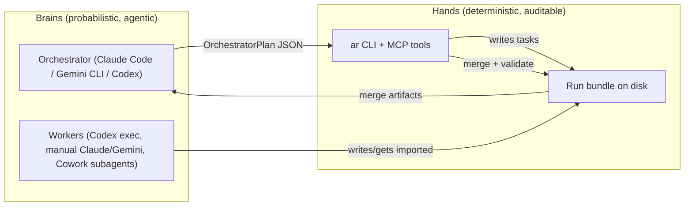

# Codebase + Design Review (2026-03-04)

Scope: `/Users/rookslog/Development/agentic-research-orchestrator` (v1).

This review focuses on:
- coherence of the run-bundle + CLI + MCP architecture
- friction points (UX, naming, “where are the agents?” confusion)
- research-quality affordances (conflicts/residuals/probes)
- second-order consequences and quality gates beyond unit tests

It intentionally includes both “software best practices” and “epistemic best practices”, since this repo’s purpose is *reliability of research outcomes*, not just correct code.

---

## 0) Executive summary (TL;DR)

**What’s strong and coherent**
- The **deterministic substrate** (run bundle contract on disk + merge/validate) is consistent with the repo’s stated goals: compaction survival, auditability, and cross-runner comparison.
- The “avoid over-determinism” stance is implemented in the *right place*: task-writing guidance, residuals-first acceptance, and conflict preservation.
- The MCP server uses **least privilege defaults** (write tools gated) and **confinement** (`--allow-run-dir-prefix`) in a practical, low-complexity way.

**What currently causes confusion / friction**
- The word **“runner” is overloaded** (execution runner vs orchestrator runner), and docs/skills accidentally mix them.
- `STATE.json.status` transitions are inconsistent: some commands set “running/merging” but don’t reliably reset status when finished, which makes `ar run status` feel “wrong”.
- Merge conflict detection relies on **`original_claim_id` collisions**. This is okay as a *heuristic*, but it is easy to generate false “conflicts/agreements” because multiple producers often start numbering claims at `C-0001`.

---

## 1) Mental model: where the “agents” are

ARO is not “an agent” by itself. It’s an **epistemic substrate**:
- **Disk contract** (run bundles) = memory + audit trail
- **CLI/MCP tools** = safe hands (scaffold, write, merge, validate)
- **LLMs/clients** (Codex/Claude Code/Gemini CLI/etc.) = interchangeable brains that propose tasks, execute research, and produce outputs

Practical “brain/hands” split:

**Why this is good epistemically:** the “brain” can be explorative/non-deterministic, but the “world state” remains reproducible and inspectable.

---

## 2) Design decisions: what’s “best practice” here (and why)

### 2.1 Deterministic merge is a feature, not anti-agentic
For research systems, determinism is a reliability layer:
- It enables **auditability** (“why did we think that?”).
- It enables **comparability** (same inputs → same merge outputs).
- It enables **error correction** (you can patch merge logic and re-run).

The agentic part is delegated to:
- `ar run generate-tasks` / `propose-followups` (a Codex supervisor emitting a plan)
- any external orchestrator via MCP prompts/tools (Claude Code, Gemini CLI, etc.)

### 2.2 “Residuals” are the right epistemic escape hatch
Residuals prevent the schema from becoming a Procrustean bed:
- Some important research output is **meta-level** (unknowns, tensions, “this depends”) and shouldn’t be forced into claims.
- Keeping residuals explicit supports *organized skepticism* and follow-up tasking.

### 2.3 Confinement-first MCP is the correct safety posture
The combination of:
- `--allow-run-dir-prefix` confinement
- explicit `--write-enabled`
- symlink-escape checks
- tool-call logging into the run bundle (`12_SUPERVISOR/MCP_LOG.jsonl`)

…is a pragmatic best-practice bundle for local MCP servers.

---

## 3) Coherence check: specs vs implementation (high-level)

Overall: `docs/RUN_BUNDLE_SPEC.md`, `docs/CLI_SPEC.md`, and implementations in `src/ar/run/*` are aligned.

Notable (good) alignments:
- producer contract enforced (placeholders for missing registers; residuals required)
- `spawn-codex` uses `codex exec --json` and parses token counts
- merge is non-destructive (claims preserved; conflicts surfaced)
- validate distinguishes “incomplete” (no producers) vs “invalid/corrupt”

---

## 4) Friction & disjointedness (what to fix)

### 4.1 Terminology collision: `runner` vs `runner`
Today:
- `export-prompts --runner <runner>` means **execution runner** (claude_desktop, gemini_deep_research, …)
- `export-orchestrator-prompt --runner <runner>` means **orchestrator client** (claude_code, gemini_cli, …)

This is coherent in code but confusing in docs/skills. It’s easy to do:
- “export prompts for Claude Code” and pass `claude_code`, but `export-prompts` doesn’t currently accept it.

Recommendation:
- Clarify in docs: “runner (execution)” vs “orchestrator (client)”
- Optionally add `claude_code` as a supported execution runner in `export-prompts` *or* remove it from skill examples.

### 4.2 `STATE.json.status` transitions feel incorrect
Examples:
- `spawn-codex` sets run status to `running` but does not set it to something “finished” on success.
- `merge` sets run status to `merging` but does not set it back on completion.

Second-order effect: `ar run status` becomes less trustworthy, which discourages “tight loops” and makes the system feel brittle.

Recommendation:
- Make status transitions explicit:
  - `spawn-codex` success → `running` → `partial|running`? (or introduce `produced` in v2)
  - `merge` success → `merging` → `running` (or `validated` only after validate)
  - `merge` conflicts → set `partial` (since validate preserves partial)

### 4.3 Conflict detection key: `original_claim_id` collisions
Current behavior (merge):
- Groups claims across producers by each claim’s original `claim_id` (stored as `original_claim_id`)
- If two producers both use `C-0001` for unrelated first claims, merge can emit false conflicts/agreements.

This is acceptable for v1 *only if treated as a heuristic*, but it can create noise and erode trust.

Recommendations (in increasing ambition):
1) **Doc-level mitigation:** require per-task claim ids to be *semantically stable* (“C-0001 means the same slot”) if you want cross-producer conflicts. Otherwise treat conflicts as “possible”.
2) **Prompt-level mitigation:** in exported runner prompts, instruct producers to include a stable `topic_key` (short string) per claim, then use that for grouping.
3) **Code-level mitigation:** compute a deterministic `claim_fingerprint` from normalized `(area, recommendation)` and group by that for “agreements”; reserve “conflict” only for pairs that share a fingerprint but differ in polarity markers (hard).

---

## 5) Research-quality affordances (epistemology → features mapping)

### Popper (falsification) → probes, not performative checkboxes
The repo’s use of **probes** is the right operationalization:
- Many recommendations aren’t cleanly falsifiable.
- Probes convert abstract disagreement into discriminating observations.

Recommendation: treat probes as first-class QoL:
- Add a lightweight “probe runner” convention: when a probe is executed, store results under `30_MERGE/PROBES/`.

### Lakatos (research programmes) → keep competing cores visible
Conflict preservation + residuals implement the idea that:
- you don’t collapse competing explanations too early
- you track degenerating vs progressive “programmes” over time

Recommendation:
- Add an optional register like `PROGRAMMES.md` that groups claims into “approach families” (with conditions).

### Bayesian updating → provenance + comparison JSON
Comparisons + token telemetry are the mechanism for updating priors:
- “Which runner/model profile catches contradictions for this domain?”
- “When does `high` pay off vs `medium`?”

Recommendation:
- Add a small “evaluation harness” script later (v2): aggregate `COMPARISON.json` across runs to show trends.

### Mertonian norms / organized skepticism → adversarial pass
Best practice in research is institutionalized skepticism.

Recommendation:
- Add a canonical task pattern: a “skeptic/falsifier” task generated automatically when merge emits `conflict` or `counterexample_missed`.

---

## 6) Quality gates beyond tests (between phases)

Current gates:
- `pytest -q` (CI)
- `ar run validate` structural checks + non-destructive merge invariant

Recommended additional gates (low-friction):
1) **Task lint (static):** verify `10_TASKS/*.md` contain required headings (Intent, Deliverables, Contradiction protocol, Stop rules).
2) **Run completeness check:** ensure every task has ≥1 producer (or explicitly marked skipped) before merge.
3) **Synthesis sanity check:** if merge produced conflicts, require a follow-up plan or explicit “conflicts accepted” note before declaring the run “done”.

These gates can be enforced by:
- a new `ar run lint` command (future)
- or by extending `ar run validate` with warnings (v1-compatible)

---

## 7) Suggested next work (prioritized)

P0 (high ROI, low risk):
- Fix the `runner` terminology confusion in docs/skills (and/or support `claude_code` in `export-prompts`).
- Normalize `STATE.json.status` transitions so `status` matches reality after `spawn-codex` and `merge`.

P1 (research-quality):
- Reduce false “conflicts” by improving cross-producer claim matching (see §4.3).
- Add a `task lint` quality gate (headings + stop rules).

P2 (ecosystem QoL):
- Add “Python install guidance” (pipx/uv) and an installer check that `python3 -m ar --help` works for the configured python command.
- Optional: Claude Desktop extension packaging (`.mcpb`) as a convenience layer (already listed as a candidate follow-up).

